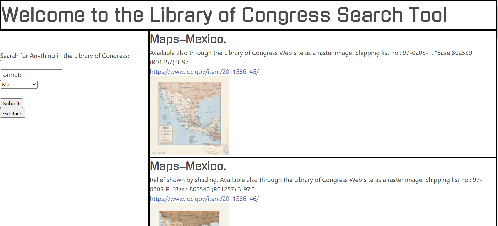

# Library of Congress Search

## Your Task:
A simple application that searches and displays results from the Library of Congress API.

## Built With:
* HTML
* CSS
* Javascript
* [Library of Congress API](https://libraryofcongress.github.io/data-exploration/index.html)

## Deployed Links:
* [See Live Site](https://egraham96.github.io/Library-of-Congress-Search/)
* [Link to GitHub Repo](https://github.com/egraham96/Library-of-Congress-Search)
                                                                                        
## Preview of Working Site:

## How to Contribute:
If you'd like to contribute to this project please send an email to eeg4@uw.edu or message me on github: egraham96

## License:

